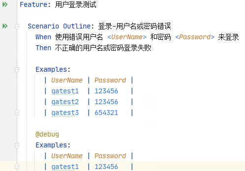
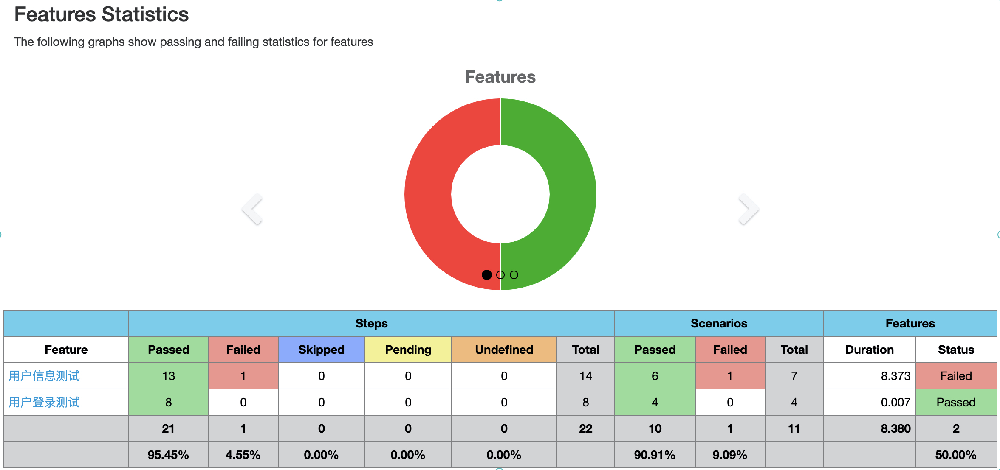
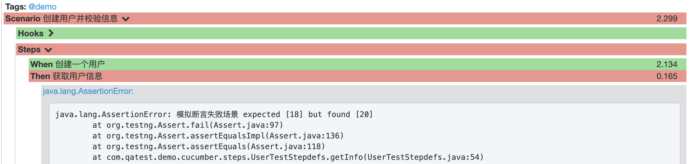

# 接口自动化测试框架

## 框架优势：
* 使用自然语言来描述测试场景，提高可阅读性，清晰易懂，便于交流，可维护性强
* 简化API的封装工作，极大减少代码量，关于接口定义和调用更加清晰规范
* 规范的日志内容，巧妙的链路跟踪能够快速发现并定位问题
* 强大的报告功能，支持多种格式，界面美观，内容易懂

## 技术栈
Cucumber + Retrofit2 + TestNG + Lombok

## 功能介绍

框架的功能将从用例组织->接口封装->测试执行->测试报告展示四个方面来介绍。

### 用例组织

Cucumber是BDD模式下实现可执行规范（Executable Specifications）的开源工具，使用Cucumber来组织用例，带来的好处如下：
* 自然语言编写用例，极大提高可阅读性，能够将纯文本功能描述(使用Gherkin语言编写)作为自动化测试执行，他不仅能把用例中的测试步骤以非常友好的形式展现出来，而且能够非常灵活的构建场景
* 改善测试团队成员之间的沟通，即使非用例维护者也能很清晰的筛选出测试场景，参与到执行自动化测试的过程中
* 标签能够以非功能的方式很好地组织你的特性与场景，比TestNG的分组功能更灵活
* 更多可查阅官方文档

Cucumber主要使用步骤：

1.创建feature文件

Cucumber是以feature文件来组织测试的，可查看测试框架中src/test/resources/feature/login.feature文件中的示例
```
Feature: 用户登录测试

  Scenario Outline: 登录-用户名或密码错误
    When 使用错误用户名 <UserName> 和密码 <Password> 来登录
    Then 不正确的用户名或密码登录失败

    Examples:
      | UserName | Password |
      | qatest1  | 123456   |
      | qatest2  | 123456   |
```

2.生成测试Step Definitions

在Intellij IDEA下可通过cucumber插件快速生成step文件及对应的step definition method，根据需求编写实现代码

```
@When("创建一个用户")
public void createUser() throws IOException {

    Response response = RetrofitManager.getCommonApi().createUser(GetHeaders.getHeaders()).execute();
    UserResponse userResponse = ConvertResponse.convertResponse(response, UserResponse.class);

    framework.setUserResponse(userResponse);
    log.info(framework.getUserResponse().getUserId());
    Assert.assertEquals(framework.getUserResponse().getUserId(), 1);
}
```

3.运行测试用例

方式一：IDEA下直接运行Scenario/Scenario Outline



该方式比较适合单场景下的运行或者调试

方式二： Run with TestNG 方式

通过@Test和@CucumberOptions注释，示例参见com.qatest.demo.cucumber.runner.RunClass，可直接在文件中运行配置的测试用例。

Cucumber中的标签tag是以”@”字符开头的一个单词，用来表述被修饰对象（可以是feature、scenario、scenario outline，甚至可以是scenario outline下的examples）所属的类别，为Cucumber测试用例集合添加不同的维度，从而便于检索和过滤。

方式三：TestNG xml方式

通过配置TestNG xml来运行测试，可通过maven命令来执行（mvn clean test -DsuiteXmlFile=xml/Test.xml）便于集成到Jenkins平台。


### 接口封装
API的封装使用Retrofit2框架，它是Square公司开发的现在非常流行的网络框架。Retrofit2是一个RESTful的HTTP网络请求框架的封装，它是基于OkHttp实现的，即Retrofit实际工作仅负责网络请求接口的封装，而网络请求的工作本质是OkHttp完成的。它的一个特点是包含了特别多注解，方便简化你的代码量。

Retrofit将Http请求抽象成Java接口，采用注解描述网络请求参数和配置网络请求参数，使得接口定义更加简洁优雅，示例参考com.qatest.demo.api.CommonApi，如：

```
@HTTP(method = "GET", path = "project/getInfo/{userId}")
Call<PersonResponse> getInfo(@HeaderMap Map<String, String> headers, @Path("userId") int userId);
```

Retrofit2的使用步骤：
1. 定义接口类（封装URL地址和数据请求）
2. 实例化Retrofit，并通过Retrofit实例创建接口服务对象
3. 发送网络请求，对返回的数据进行处理，对于返回的结果Retrofit支持多种方式数据解析（如Json、xml），也可通过自定义数据解析器来实现，此Demo示例中使用GsonConverterFactory


### 测试执行

测试执行方式在介绍cucumber时已经详细介绍了几种运行方式，这里重点介绍一下测试过程中的日志：

1. MDC和TestNG的监听器配置：为每个测试场景执行过程中增加TraceID，即使在并发的场景中也能快速的通过TraceID过滤出关联日志；测试场景运行失败后的打印异常堆栈信息，帮助快速高效定位问题
2. OKHTTP拦截器：输出有效日志，对于HTTP请求输出可直接执行的curl日志、请求响应日志如请求code、response
```
[INFO ]22:46:06,759, [Class]URLLogger, [Method]writeCurlRequest, [478b2b43-6987-4bce-ac54-bca61d37ebbd] - curl -X GET -i 'https://www.fastmock.site/mock/4781f56c048f58011a898e8fd30e15ca/project/getInfo/1' -H "Accept: application/json" -H "Content-Type: application/json; charset=utf-8"
[INFO ]22:46:07,100, [Class]OkHttpLogger, [Method]intercept, [478b2b43-6987-4bce-ac54-bca61d37ebbd] - 200 [340ms] 
[INFO ]22:46:07,101, [Class]OkHttpLogger, [Method]intercept, [478b2b43-6987-4bce-ac54-bca61d37ebbd] - response: {
  "person": {
    "name": "pig",
    "age": "20",
    "hometown": {
      "province": "浙江省",
      "city": "杭州市",
      "county": "滨江区"
    }
  }
}
```

### 测试报告展示

使用cucumber-report，根据原生的Json测试报告来生成HTML格式的较美观的测试报告，且支持按features、tags、steps、failures来查看报告。

当前设置的报告路径在taget/cucumber-reports下，执行用例结束后可查看taget/cucumber-reports/cucumber-html-reports中的报告，效果如下：



若有测试用例运行失败，也可直观的查看到失败的场景及异常日志：




## 补充

### Lombok
Lombok是一个通过注解以达到减少代码的Java库：
* 优化set和get方法，通过注解@Data形式引入，减少一些get/set/toString方法的编写，虽说IDEA的插件可以自动生成get/set/toString方法，但是使用Lombok可以让代码更简洁，示例可参考com.qatest.demo.model
```
@Data
public class Hometown {

    private String province;
    private String city;
    private String county;

}
```
* 注解@Log4j，为类提供一个属性名为log的log4j日志对象，提供默认构造方法。正常情况下，我们需要在每个类里定义获取log(```private static final Logger log = Logger.getLogger(URLLogger.class);```)，使用Lombok中的注解即可省去这一行代码。

### 打包
通过 mvn clean package -Dmaven.test.skip=true 命令进行打包，执行 java -jar easy-autotest-1.0-SNAPSHOT.jar xml/Test.xml  即可进行测试，方便集成到docker镜像中